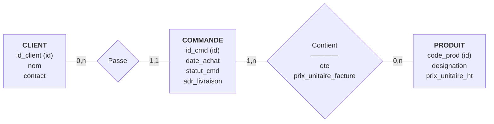

# MegaShop-B2B — Modèle Conceptuel de Données (MCD)
 
## Schéma
 
Diagramme en `flowchart` (et non `erDiagram`) : ce type de diagramme Mermaid sait tracer de vrais **losanges** pour les associations, ce que le formalisme crow's-foot de `erDiagram` ne permet pas — c'est la représentation la plus proche du formalisme Merise.
 

 
Les entités sont des rectangles, les associations "Passe" et "Contient" sont de vrais losanges, et chaque trait porte directement sa cardinalité `(min,max)` exacte — plus besoin de traduire en symboles crow's-foot qualitatifs (`||`, `o{`...).
 
## Lecture en cardinalités Merise (min,max)
 
**Association "Passe" (CLIENT ↔ COMMANDE)**
`CLIENT (0,n) —— (1,1) COMMANDE`
Un client peut avoir passé de 0 à n commandes. Une commande est passée par exactement un client.
 
**Association porteuse "Contient" (COMMANDE ↔ PRODUIT)**
`COMMANDE (1,n) —— (0,n) PRODUIT`
Une commande contient au moins un produit, jusqu'à n. Un produit peut être présent dans 0 à n commandes.
 
Le losange `Contient` porte les attributs `qte` et `prix_unitaire_facture` : ils n'appartiennent ni exclusivement à COMMANDE, ni exclusivement à PRODUIT, mais au couple des deux, ce qui est précisément la définition d'une association porteuse.
 
## Piège évité
 
La quantité (`qte`) n'est placée ni dans `CLIENT`, ni dans `PRODUIT`. La mettre dans `PRODUIT` signifierait qu'un produit n'a qu'une seule quantité globale, valable pour toutes les commandes de l'univers — ce qui est faux : `P-01` a une quantité de 2 dans `CMD-901` et de 1 dans `CMD-902`. La quantité dépend du couple (commande, produit), donc elle est portée par l'association "Contient".
 
De la même façon, `prix_unitaire_facture` (le prix réellement payé, figé au moment de l'achat) est porté par l'association, et non par `PRODUIT` (dont le `prix_unitaire_ht` représente le prix catalogue courant, qui peut évoluer sans affecter les commandes déjà passées).