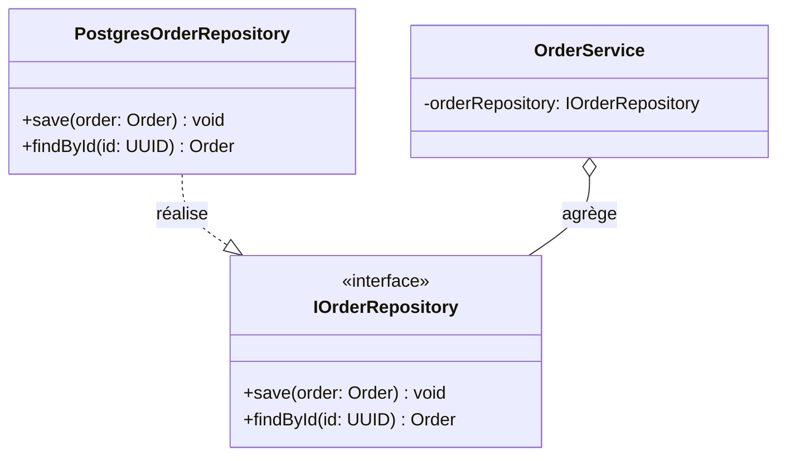

# UML Avancé — Diagramme de Classes

```mermaid
classDiagram
    class IOrderRepository{
        <<interface>>
        +save(order: Order) void
        +findById(id: UUID) Order
    }

    class PostgresOrderRepository {
        +save(order: Order) void
        +findById(id: UUID) Order
    }

    class OrderService {
        -orderRepository: IOrderRepository
    }

    PostgresOrderRepository ..|> IOrderRepository : réalise
    OrderService o-- IOrderRepository : agrège
```
