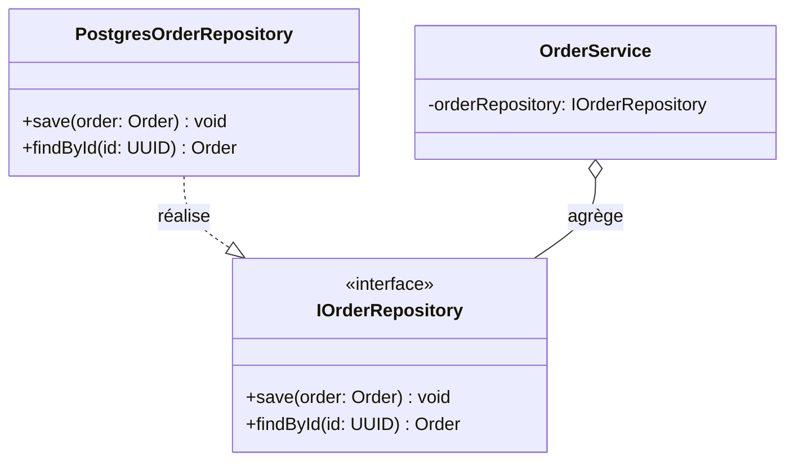

# Diagramme de Classes — Isolation du Repository

Ce diagramme modélise l'inversion de dépendance entre `OrderService` et la couche de
persistance : le service ne dépend que de l'interface `IOrderRepository`, jamais de
l'implémentation concrète `PostgresOrderRepository`. Cette isolation permet de tester
`OrderService` avec un faux repository (mock/stub), sans jamais démarrer une vraie
base PostgreSQL.

`OrderService` ne connaît et ne référence à aucun moment `PostgresOrderRepository` :
le seul lien entre les deux passe par `IOrderRepository`, ce qui élimine tout
couplage technologique direct et rend le service substituable pour les tests unitaires.