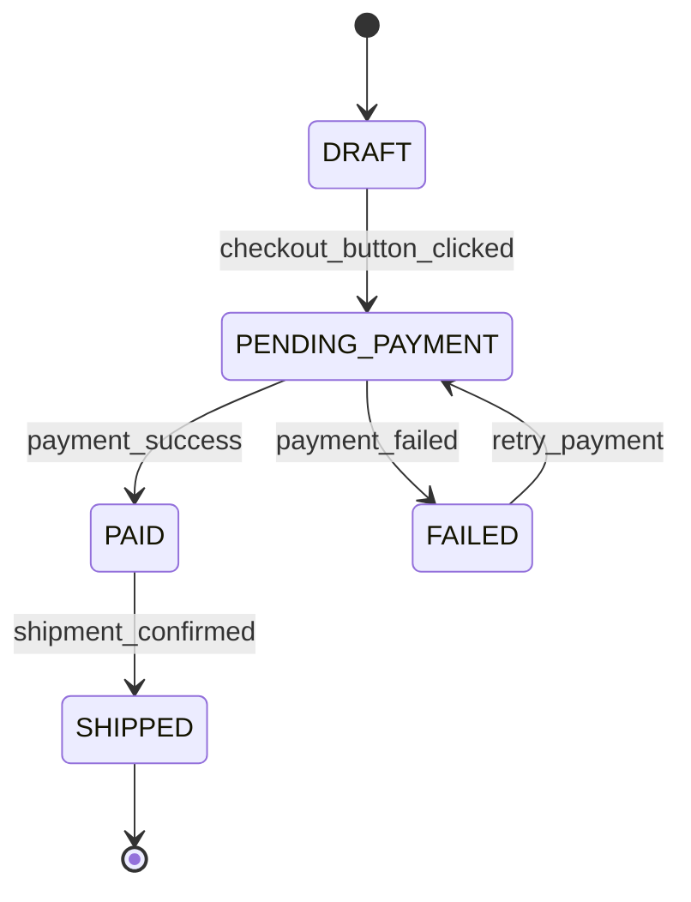

# # Diagramme d'États-Transitions — Commande

Ce diagramme modélise le cycle de vie d'une commande, en garantissant qu'aucune commande
ne peut atteindre l'état `SHIPPED` sans être passée par un paiement validé (`PAID`).

Chaque transition est étiquetée par l'événement métier ou l'action technique qui la déclenche,
pour que l'équipe d'ingénierie puisse tracer une transition jusqu'à son déclencheur réel.