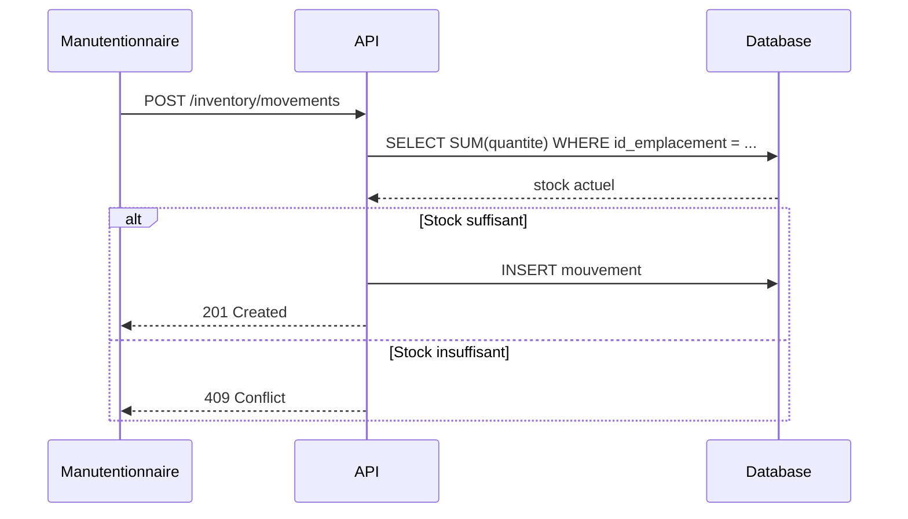

# Architecture Comportementale — Mouvement de Stock
 
Ce diagramme modélise le traitement d'une création de mouvement de stock (`POST /inventory/movements`) :
l'API vérifie le stock disponible avant de valider ou de rejeter la requête.
 

 